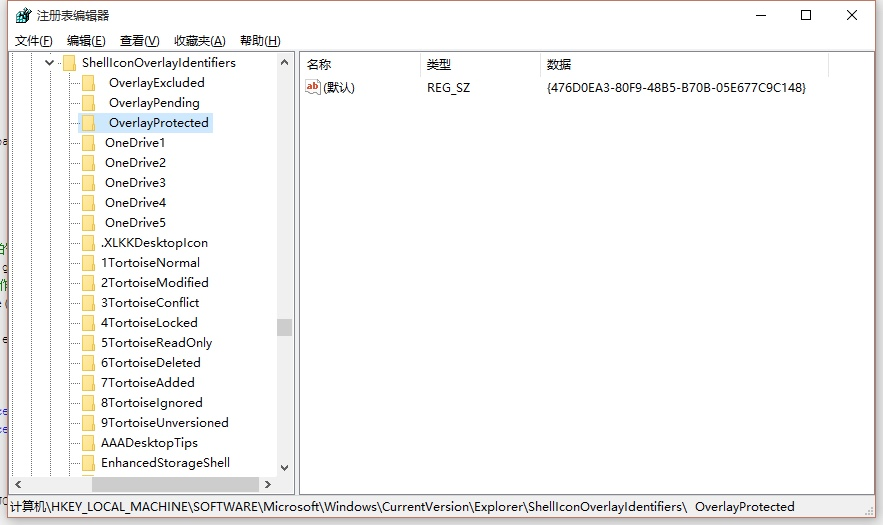

**解决方法一（失败）：**

升级最新版本，我的本来就是最新版本

**解决方法二（失败）：**

右键->TortoiseSVN->setting->Icon Overlays->Status cache->default/Shell。none是不显示

**解决方法三（失败）：**

修复或者卸载重装

**解决方法四（成功）：**

Windows Explorer Shell 支持 Overlay Icon 最多15个，Windows 自身已经使用了4个，所以就只剩下了11个 供我们使用。如果你之前安装了例如Groove这样的软件，那么可能我们可利用的就更少了，轮不到Tortoise了。像这样的情况，我们可以调整 Tortoise图标名称的字母顺序，来提高Tortoise的优先位置，因为Windows 内部就是安装名称的字母顺序来优先显示的。 解决的步骤 在 运行里 输入 regedit 进入 注册表 界面，HKEY_LOCAL_MACHINE->SOFTWARE->Microsoft->Windows->CurrentVersion->Explorer->ShellIconOverlayIdentifiers打开后发现Tortoise 系列（1TortoiseNormal，2TortoiseAdded等）前面有好多项，Tortoise 系列排到了15名之后，难怪不显示。现在的任务就是把它们提到前面了，修改一下它们的名字就好（我是看第一项的前缀是空格，说明空格的字符排序在前面，我就加了几个空格），我改后的名字如（ TortoiseNormal， TortoiseAdded等），然后关闭再打开注册表，发现Tortoise 系列系列图标已经排到前面了，这时SVN的图标并没有显示，靠，重启Explorer（在任务管理器中结束explorer.exe，在文件 -> 新建任务 -> 输入explorer，当然可以重启电脑，不过好sb），这样就ok了，可爱的SVN图标又出现了。

**总结：**

原因可能是因为我安装了好多的同步网盘（金山快盘，酷盘，everbox，百度网盘，dropbox等）占用了15 Overlay Icon，怪不得有的同步网盘的状态图标不显示呢。但是这样SVN的图标是显示了，但是肯定其他什么软件的图标又会不显示了。

来源： <[http://www.cnblogs.com/likebeta/archive/2012/07/01/2571731.html](http://www.cnblogs.com/likebeta/archive/2012/07/01/2571731.html)>
